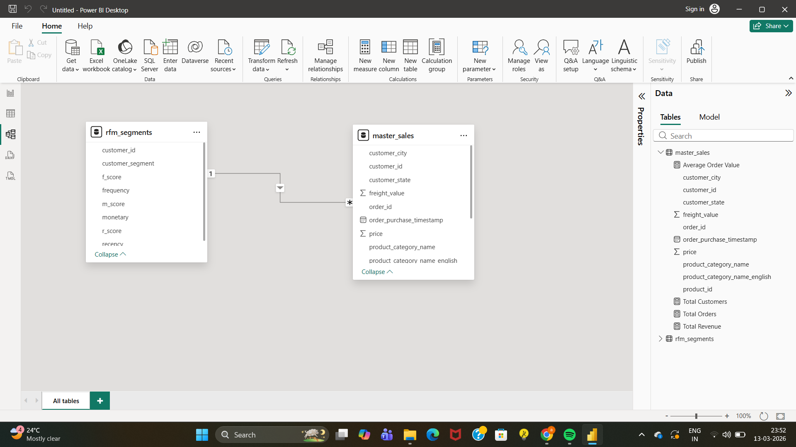
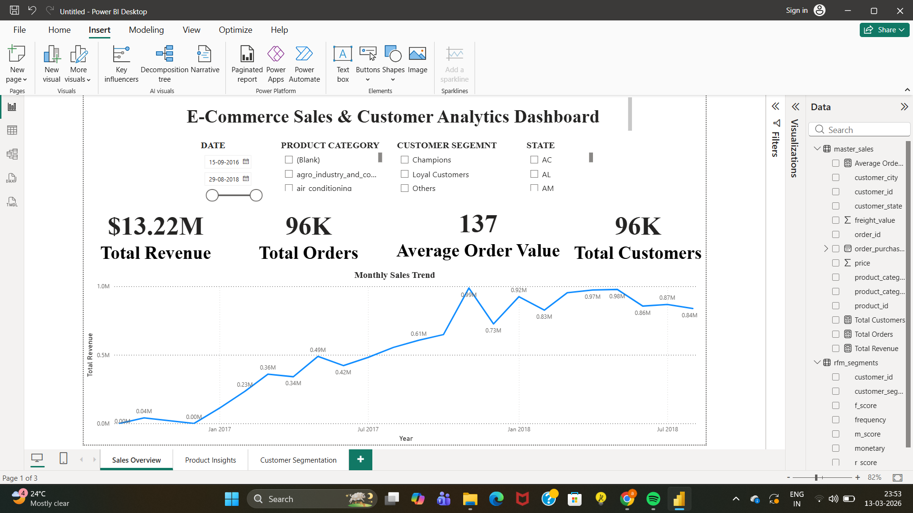
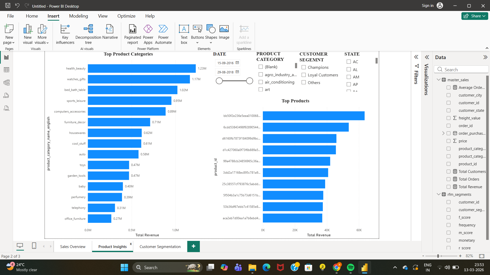
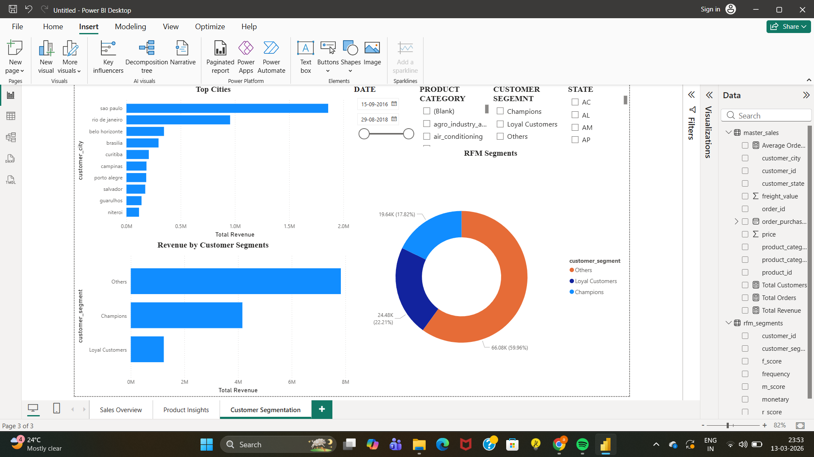

# E-Commerce Customer Analytics

This project analyzes customer purchasing behavior and sales performance of an e-commerce platform using **SQL Server and Power BI**. The objective is to generate actionable insights about revenue trends, product performance, and customer segments.

---

## Project Overview

Understanding customer behavior is essential for improving sales and retention in e-commerce businesses.

This project performs an **end-to-end analytics workflow** including:

• Data exploration and transformation using **SQL Server**
• Customer segmentation using **RFM Analysis**
• Data visualization using **Power BI**
• Business insight generation from transactional data

---

## Dataset

This project uses the **Brazilian E-Commerce Public Dataset by Olist**, which contains real transactional data from an online marketplace.

The dataset includes:

* Customers
* Orders
* Order Items
* Payments
* Reviews
* Products
* Sellers
* Geolocation

Dataset source:

https://www.kaggle.com/datasets/olistbr/brazilian-ecommerce

Note: Due to GitHub file size limitations, the dataset is not stored in this repository. You can download it from the Kaggle link above to reproduce the analysis.

---

## Tools & Technologies

**SQL Server (SSMS)**
Used for data cleaning, transformation, and analytical queries.

**SQL**
Used for data analysis and customer segmentation using the **RFM model**.

**Power BI**
Used to create an interactive dashboard and visualize insights.

**GitHub**
Used for version control and project documentation.

---

## Database Schema

The database schema connects customers, orders, payments, and product tables to enable full e-commerce analysis.



---

## Dashboard Overview

The Power BI dashboard consists of three main pages that provide insights into sales performance, product trends, and customer segmentation.

---

### Sales Overview

This page presents high-level business performance metrics including:

* Total Revenue
* Total Orders
* Average Order Value
* Total Customers
* Monthly Revenue Trend



---

### Product Insights

This page highlights product performance and identifies the most profitable categories and products.

Key insights include:

* Top selling product categories
* Revenue contribution by category
* Best performing products



---

### Customer Segmentation

Customers are segmented using **RFM Analysis**:

* **Recency** – How recently a customer placed an order
* **Frequency** – How often a customer purchases
* **Monetary** – Total amount spent by the customer

Customers are grouped into segments such as:

* Champions
* Loyal Customers
* Others



---

## Key Insights

• Total Revenue: **$13.22M**
• Total Orders: **96K**
• Average Order Value: **$137**

Additional findings:

* Health & Beauty is the top performing product category
* Loyal and champion customers contribute significantly to revenue
* Customer segmentation helps identify high-value customers

---

## Project Structure

```
ecommerce-customer-analytics
│
├── sales_overview.png
├── product_insights.png
├── customer_segmentation.png
├── er_diagram.png
│
├── ecommerce_customer_analytics_dashboard.pbix
├── ecommerce_customer_analytics.sql
│
└── README.md
```

---

## How to Reproduce This Project

1. Download the dataset from Kaggle.
2. Import the CSV files into SQL Server.
3. Run the SQL queries to perform data analysis and RFM segmentation.
4. Open the Power BI dashboard file to explore the visual insights.

---

## Author

**Atishay Jain**
Aspiring Data Analyst
